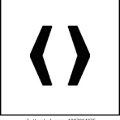

# 1. Guía de Estilo básica SIL JOQ

# Uso de logotipo

El logotipo consta de dos colores principales el rgb(65, 207, 250) es un azul que nos transmite seriedad y el rgb(255, 206, 56) es un tono amarillo anaranjado que nos transmite energía y confianza.
Son dos tonos muy apropiados para un logotipo de una Web de moda.

He combinado estos dos colores del logo con una cabecera en fondo negro, ya que resalta muy bien con los colores de nuestra marca creando un aspecto muy visual y elegante.

# Gama de colores 

Como hemos mencionado anteriormente los colores del logo nos tramiten seriedad, energía y confianza.
Son dos colores contiguos ya que se encuentran muy cerca en el círculo cromático y no llegan a ser opuesto. Por lo tanto esto nos transmite calma y armonía.

El negro utilizado para el fondo de la cabecera proporciona un fondo elegante y muy corporativo que destaca con los colores de nuestro logotipo. 
También lo he utilizado para el fondo del footer y de los botones para resaltar el contenido.

Por último he utilizado el color blanco para el resto de la página para que la web se vea limpia y destaque con los fondos negros.

# Tipografía y Fuentes

## Helvetica Neue -->  My fonts

### Estilos

Título del menú: Helvetica Neue Thin / 22px / rgba (0, 0, 0, 0.75)

Active: Helvetica neue Medium / 22px / rgb(255, 206, 56)

Título lista de productos: Helvetica Neue Medium/ 24px / #000000

## Gothan thin --> Fontsgeek 

### Estilos

Texto botones: Gothan Thin / 20px / #FFFFFF

Texto input: Gothan Thin  / 13px / #000000

Títulos footer: Gotham Thin  / 20px / #FFFFFF

## Geo Sans Light --> Dafont

### Estilos

Texto filtros: Geo Sans Light  / 17, 14px / #000000

Texto productos: Geo Sans Regular / 19px / #000000

Texto footer: Geo Sans Thin / 15px / #FFFFFF
***

He utilizado mayúsculas en los botones (ver novedades y suscripción), en el menú y  en el título de la sección de productos para destacarlos.

# Iconos

1.	Icono de Menú (Hamburguesa): Su diseño universalmente reconocido facilita a los usuarios el acceso a una navegación organizada.
   
	  

3.	Icono de Búsqueda (Lupa): Su diseño intuitivo permite a los usuarios realizar búsquedas rápidas en el sitio, mejorando significativamente la experiencia de navegación.

 	  

5.	Icono de Usuario: Este icono es esencial para una experiencia de usuario intuitiva, facilitando el acceso a cuentas personales.

	  

7.	Icono de Carrito: El diseño del carrito  proporciona una experiencia de compra intuitiva, permitiendo a los usuarios añadir y revisar productos seleccionados con facilidad.

   	

9.	Icono de Slider (Flechas): Estos iconos mejoran la navegabilidad del sitio, permitiendo a los usuarios deslizarse a través de contenido.

	  

11.	Icono de Redes Sociales: Este icono invita a los usuarios a interactuar y conectarse a través de las redes sociales

	  

   	
